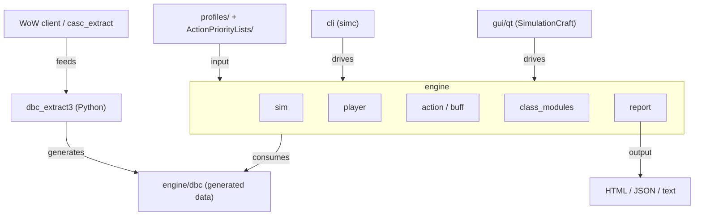

# SimulationCraft: Top-Level Architecture

30,000-ft view of how SimulationCraft's major components fit together and the data flow between them.
Read `04-directory-map.md` for folder-by-folder detail; continue with `02-engine-core.md` to go deeper into the engine subsystems.

---

## Component diagram

The diagram shows three top-level data flows: (1) WoW client data is extracted and compiled into C++ spell tables by the Python toolchain; (2) front-end drivers hand profile text and APL files to the engine and receive simulation results back; (3) the engine reads compiled spell data at run-time and writes its HTML/JSON/text reports when the simulation completes.

---

## Components

### Engine

The simulation engine (`engine/sc_main.cpp:1`) is the heart of the project — a multi-player, event-driven C++ simulator written to C++17. `sc_main.cpp` parses command-line options, constructs a top-level `sim_t` object, and delegates everything else to the engine subsystems listed below. The engine is also the only component that is compiled into both the CLI and the Qt GUI executables.

Key engine subsystems visible in the `sc_main.cpp` include list:

- **sim** (`engine/sim/sim.hpp:1`): owns the event queue, raid layout, scale-factor sweeps, profilesets, and progress reporting. `sim_t` is the root object of every simulation run.
- **player** (`engine/player/player.hpp:1`): the `player_t` base class models a single character — stat caches, gear, action-priority list scheduling, azerite data, and unique-gear dispatch all live here.
- **action / buff** (`engine/action/action.hpp:1`, `engine/buff/buff.hpp:1`): `action_t` is the base for every spell, attack, heal, and absorb; `buff_t` manages stack-based stat modifiers, durations, and refresh logic.
- **class_modules** (`engine/class_modules/class_module.hpp:1`): one `.cpp` file per WoW class, each registering itself through the `class_module.hpp` interface. This is where the per-spec rotation and talent logic lives.
- **report** (`engine/report/reports.hpp:1`): consumes the completed `sim_t` state and emits HTML, JSON, and plain-text reports with embedded Highcharts chart data and gear-weight tables.

### DBC data layer

`engine/dbc/dbc.hpp:1` exposes the compiled spell-database API consumed at run-time by every other engine module. The database tables (spell stats, hotfix overlays, talent trees, azerite/embellishment data) are C++ source files generated by `dbc_extract3` and committed to `engine/dbc/`. At run-time the engine treats them as read-only lookup tables; nothing in this layer performs I/O.

### dbc_extract3

`dbc_extract3/dbc_extract.py:1` is the Python 3 toolchain that translates raw WoW client data into the C++ spell tables that live in `engine/dbc/`. It reads `.dbc`/`.db2` files (supplied either directly from the WoW installation or unpacked by `casc_extract/casc_extract.py:1`) and emits C++ initializers that are committed back to the repository. Developers run this tool when a new WoW patch changes spell data; normal contributors never need to run it.

### Front-ends: CLI and Qt GUI

Two executable front-ends drive the engine:

- **cli (simc)** (`cli/cli.pro:1`): a qmake project stub that links the engine into a command-line binary. Users pass `.simc` profile files and APL overrides on the command line; the binary writes report files to disk on completion. This is the recommended interface for automation, CI, and theorycrafting scripts.
- **gui/qt (SimulationCraft)** (`qt/MainWindow.hpp:1`): a Qt-based desktop GUI that wraps the same engine behind a tabbed window — Import, Simulate, Overrides, Results, and Charts tabs. The GUI is the primary interface for casual users downloading desktop releases.

Both front-ends link the same compiled engine object; they differ only in how they accept input and present output.

### Profiles and Action Priority Lists

Profile files (`profiles/CI.simc:1`) describe a simulated character: gear, talents, and simulation parameters in the `.simc` text format. `CI.simc` is the canonical smoke-test profile used by the CI pipeline. Action Priority Lists (`ActionPriorityLists/README.md:1`) are community-maintained per-spec rotation files; they are loaded by the engine's APL parser and govern the sequence in which a simulated player executes abilities during combat.

### Report

The report subsystem (`engine/report/reports.hpp:1`) is the final output stage. After `sim_t` finishes its event loop, the report layer iterates over all players, aggregates DPS/HPS/damage-taken statistics, and renders them into one or more output formats: a self-contained HTML file with embedded Highcharts charts, a machine-readable JSON file, and/or a plain-text summary. Report format is selected via command-line flags or the GUI's output settings.
