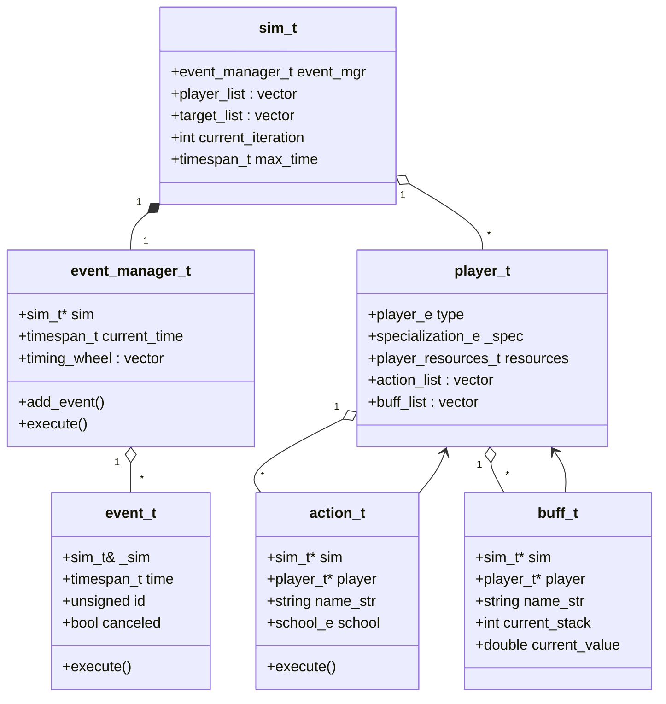

# SimulationCraft: Engine Core Object Model

The five classes that form the object backbone of every simulation run: `sim_t`, `player_t`, `action_t`, `buff_t`, and the event scheduler (`event_t` / `event_manager_t`).
Read `03-simulation-flow.md` next to see how one iteration drives this object graph from combat-start to final damage roll.

---

## Class diagram

---

## Responsibilities

### `sim_t` (`engine/sim/sim.hpp:65`)

`sim_t` is the root object of every simulation run. It owns the complete raid layout through `player_list` and `target_list` (both `vector_with_callback<player_t*>`, at `engine/sim/sim.hpp:109` and `engine/sim/sim.hpp:107`), and embeds the event scheduler as a direct by-value member `event_mgr` (`engine/sim/sim.hpp:67`). Iteration control state — `current_iteration`, `iterations`, `max_time`, and `target_error` — lives here, along with the DBC spell-data pointer (`dbc`) and all global configuration flags. Child threads created for parallel iteration each hold their own `sim_t` that refers back to the parent via `sim_t::parent`, making the parent the single source of truth for configuration.

### `player_t` (`engine/player/player.hpp:139`)

`player_t` is the abstract base class for every simulated combatant: player characters, enemies, pets, and totems. It owns the Action Priority List through `action_list` (`engine/player/player.hpp:355`) and the collection of all active buffs through `buff_list` (`engine/player/player.hpp:406`). Live resource values (health, mana, energy, rage, etc.) are held in `resources`. Pointer members `executing` and `channeling` track the action currently being cast or channeled; `readying` holds the next scheduled-action event that will fire when the player becomes ready to act. The concrete subclass for each WoW specialization is registered by its `class_module`.

### `action_t` (`engine/action/action.hpp:60`)

`action_t` is the base class for every spell, attack, heal, absorb, and triggered proc in the engine. It holds back-pointers `sim` (`engine/action/action.hpp:65`) and `player` (`engine/action/action.hpp:69`) so any piece of execute logic can reach the global simulation state and the owning character without additional look-ups. Key configuration fields set during construction include `school`, `aoe`, `background`, `channeled`, and `name_str`. The virtual `execute()` method is the single dispatch point for all action resolution: cost payment, hit/crit roll, damage or healing application, and proc triggering all flow through it or its virtual overrides.

### `buff_t` (`engine/buff/buff.hpp:58`)

`buff_t` tracks a stack-based temporary effect on a character. Back-pointers `sim` (`engine/buff/buff.hpp:61`) and `player` (`engine/buff/buff.hpp:62`) mirror those on `action_t`; `source` records which player applied the buff. The buff's lifetime is managed through `expiration` event pointers; ticking buffs additionally hold a `tick_event` pointer (`engine/buff/buff.hpp:142`). The two primary live state fields — `current_stack` and `current_value` — are queried constantly by action expressions and stat caches throughout each iteration. Refresh, stack-change, and expiry behavior are all controlled by configurable callbacks, making `buff_t` the single abstraction for auras, procs, trinket effects, and cooldown-tracking buffs alike.

### `event_t` and `event_manager_t` (`engine/sim/event.hpp:45`, `engine/sim/event_manager.hpp:21`)

`event_t` is an abstract base for a single future occurrence. Subclasses implement `execute()` (pure virtual, `engine/sim/event.hpp:83`); the base stores the fire `time`, a unique `id`, and `canceled`/`recycled` flags. All SimC scheduling goes through the `make_event<T>()` factory which uses placement-new into pre-allocated blocks for high-throughput allocation.

`event_manager_t` is the scheduler embedded by value in `sim_t`. It holds `timing_wheel` (`engine/sim/event_manager.hpp:30`), a bucket-based circular priority queue indexed by simulation time, plus a `recycled_event_list` for allocation reuse. `add_event()` inserts a new event into the wheel; `execute()` dequeues and fires the earliest pending event, advancing `current_time`. The by-value embedding in `sim_t` gives zero-indirection access to the current simulation clock from anywhere that holds a `sim_t` reference.
