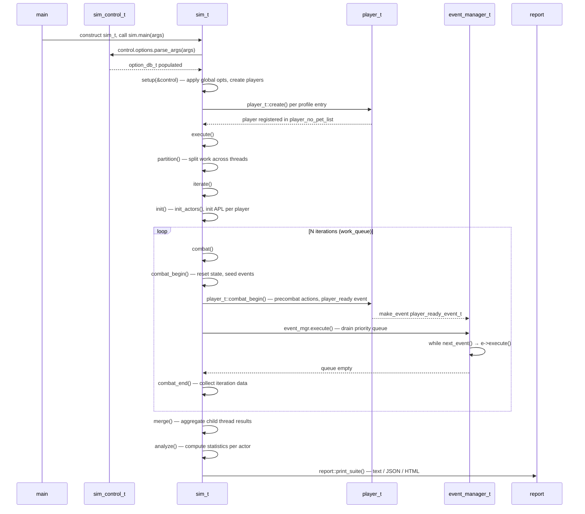
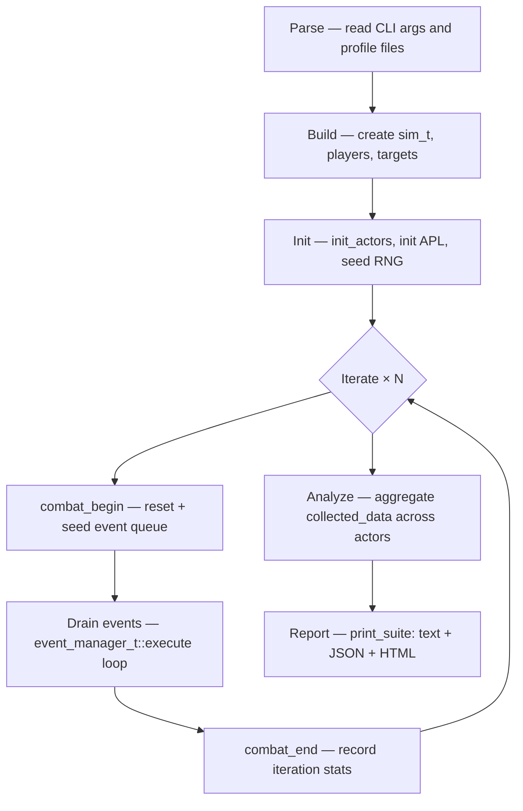

# SimulationCraft: End-to-End Simulation Flow

End-to-end control flow for a single `simc` invocation, from `main()` to final report output. Assumes familiarity with the object model described in `02-engine-core.md`.

---

## Sequence diagram

---

## Phase flowchart

---

## Phase walkthrough

### Phase 1 — Parse

Entry point is `int main()` at `engine/sc_main.cpp:401`, which constructs a `sim_t` on the stack and delegates immediately to `sim_t::main()` (`engine/sc_main.cpp:255`).

The first action inside `sim_t::main()` is CLI and profile parsing. A `sim_control_t` (`engine/sim/sim_control.hpp:39`) is created on the stack; it holds three things: `combat_description_t combat`, `vector<player_description_t> players`, and `option_db_t options`. `option_db_t::parse_args()` (`engine/sim/option.cpp:821`) processes every command-line token and profile file referenced therein, populating `options` with `(scope, name, value)` triples — global options under scope `"global"` and per-player options under the player's name.

### Phase 2 — Build

With the control object populated, `sim_t::main()` calls `setup(&control)` (`engine/sc_main.cpp:287`), dispatching to `sim_t::setup()` (`engine/sim/sim.cpp:4281`). Setup walks `control->options` twice: once to apply global options via `parse_option()` (`engine/sim/sim.cpp:4296`), and once to create player objects. For each entry in `control->players`, `player_t::create()` (`engine/player/player.cpp:13633`) instantiates the correct class module and registers the new `player_t*` into `sim_t::player_no_pet_list` and `actor_list`. Player-scoped options are then bound to the corresponding `player_t`.

### Phase 3 — Init (per thread, inside iterate)

`sim_t::execute()` (`engine/sim/sim.cpp:3428`) is called from `sim_t::main()` at `engine/sc_main.cpp:359`. It calls `partition()` to spread work across child `sim_t` threads, then calls `iterate()` (`engine/sim/sim.cpp:3459`).

`sim_t::iterate()` (`engine/sim/sim.cpp:3114`) begins with a single call to `sim_t::init()` (`engine/sim/sim.cpp:2615`). Init seeds the RNG, resolves spell data, and drives `sim_t::init_actors()` (`engine/sim/sim.cpp:2488`), which calls `sim_t::init_actor()` for every target and then every player. Per-player init walks the registered actor-initializer list in priority order, covering race/position/professions, talents, gear, and finally the Action Priority List via `player_t::init_action_list()` (`engine/player/player.cpp:4154`).

### Phase 4 — Iterate × N

After init, `sim_t::iterate()` loops (do–while at `engine/sim/sim.cpp:3137–3171`) consuming work units from `work_queue` — one unit per actor in `single_actor_batch` mode or one per full-raid iteration otherwise. Each iteration calls `sim_t::combat()` (`engine/sim/sim.cpp:1780`), which executes three steps in sequence (`engine/sim/sim.cpp:1790-1792`):

1. **`combat_begin()`** (`engine/sim/sim.cpp:1842`) — resets all state via `reset()` (`engine/sim/sim.cpp:1865`), which clears buffs, resets targets and players, and reseeds the RNG for deterministic runs. After reset, `sim_t::combat_begin()` calls `player_t::combat_begin()` (`engine/player/player.cpp:6130`) for each active player. Each player executes its precombat action list and then posts a `player_ready_event_t` into the event manager, seeding the queue for the upcoming iteration.

2. **`event_mgr.execute()`** (`engine/sim/event_manager.cpp:205`) — the core simulation loop. `event_manager_t::execute()` runs a `while` loop (`engine/sim/event_manager.cpp:214`) that calls `next_event()` (`engine/sim/event_manager.cpp:360`) to dequeue the lowest-time event from the timing wheel, advances `current_time`, and dispatches `e->execute()`. Player-ready events fire the APL decision engine, producing action events; action events produce damage/healing events, buff events, and new player-ready events — the cycle continuing until `current_time` reaches `max_time` or the target dies.

3. **`combat_end()`** (`engine/sim/sim.cpp:1963`) — notifies all actors that combat has ended (flushing any lingering events) and records per-iteration collected data.

### Phase 5 — Analyze

After all iterations complete and child threads are merged back via `merge()`, `sim_t::execute()` calls `sim_t::analyze()` (`engine/sim/sim.cpp:3462`), which is defined at `engine/sim/sim.cpp:3013`. Analyze calls `collected_data.analyze()` for every actor, sorts player lists by DPS/HPS/DTPS/APM, and calls `analyze_iteration_data()` to build the best/worst-iteration tables used for deterministic replay.

### Phase 6 — Report

Back in `sim_t::main()`, if `execute()` returned success, `report::print_suite()` (`engine/sc_main.cpp:368`) is called. Its definition at `engine/report/reports.cpp:236` drives three sequential output passes: `report::print_text()`, `report::print_json()`, and `report::print_html()` — the three functions declared in `engine/report/reports.hpp:34`.
