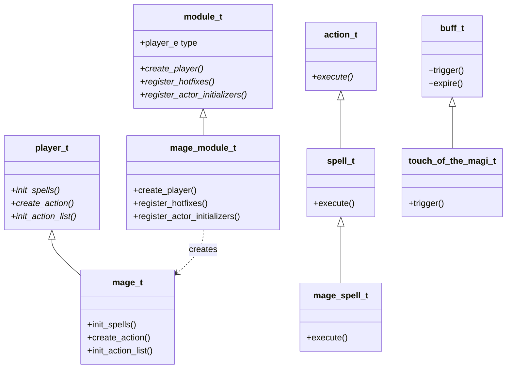

# SimulationCraft: Class-Module Pattern

The shared template that every class module follows, demonstrated through `engine/class_modules/sc_mage.cpp`.
Assumes familiarity with the base types (`player_t`, `action_t`, `buff_t`) introduced in `02-engine-core.md`.

---

## Inheritance and registration diagram



The diagram covers the six structural layers present in every single-file class module: the registration adapter (`module_t` / `mage_module_t`), the specialization character struct (`player_t` / `mage_t`), the action inheritance chain (`action_t` → `spell_t` → `mage_spell_t`), and the buff layer (`buff_t` / `touch_of_the_magi_t`). It assumes `02-engine-core.md` for the definitions of `player_t`, `action_t`, and `buff_t`.

---

## Overview

Every playable class in SimulationCraft is implemented as a self-contained translation unit under `engine/class_modules/`. The translation unit wraps everything in an anonymous namespace and exposes exactly one symbol to the rest of the engine: a static factory returned by the matching `module_t::mage()` (or equivalent) function. Inside that translation unit the same six-element recipe repeats for every class.

---

## The recipe

The numbered steps below map each element of the pattern to the real line in `engine/class_modules/sc_mage.cpp` where it appears, plus the registration interface in `engine/class_modules/class_module.hpp`.

**1. Anonymous namespace**

The entire translation unit lives inside `namespace {` (line 12 of `sc_mage.cpp`). Nothing is exported except the module factory at the bottom. Sub-namespaces `buffs` and `actions` provide an additional layer of name isolation for buff and action structs.

**2. Spec struct** — `engine/class_modules/sc_mage.cpp:207`

```cpp
struct mage_t final : public player_t
```

`mage_t` is the per-character state container. It holds all spec-specific resource gauges, talent flags, cached spell references, and pet/action pointers that `player_t` does not know about. Every virtual override declared here (`init_spells`, `create_action`, `init_action_list`, …) is the primary extension point for the specialization.

**3. Action base** — `engine/class_modules/sc_mage.cpp:1549`

```cpp
struct mage_spell_t : public spell_t
```

`mage_spell_t` inherits `spell_t` (which itself inherits `action_t`) and adds the cross-cutting behavior shared by all mage spells: damage modifiers that depend on talents, proc tracking, and helper accessors such as `p()` (typed back-pointer to `mage_t`). Concrete actions (Fireball, Frostbolt, etc.) inherit `mage_spell_t` in turn.

**4. Representative buff** — `engine/class_modules/sc_mage.cpp:1403`

```cpp
struct touch_of_the_magi_t final : public buff_t
```

Defined in `namespace buffs`, `touch_of_the_magi_t` is a good example of a module-specific buff: it overrides `buff_t`'s virtual callbacks to implement Arcane's absorb-and-detonation mechanic. Most buffs in the module follow the same pattern — inherit `buff_t`, override `expire_override` or tick callbacks, keep a typed `mage_t*` pointer cast from the base `player` member.

**5. `create_action()`** — `engine/class_modules/sc_mage.cpp:5640`

```cpp
action_t* mage_t::create_action( std::string_view name, std::string_view options_str )
```

Called by the engine's action-priority-list parser whenever it encounters a spell name it does not recognize as a generic action. The method is a large `if`/`else` chain that maps a string name such as `"fireball"` to `new actions::fireball_t(this, options_str)`. It falls through to `player_t::create_action()` for generic actions (trinkets, potions, etc.).

**6. `init_spells()`** — `engine/class_modules/sc_mage.cpp:5918`

```cpp
void mage_t::init_spells()
```

Runs during the pre-combat initialization pass. After calling `player_t::init_spells()`, this method populates every talent, spell, and mastery field on `mage_t` by calling `find_talent_spell`, `find_specialization_spell`, or `find_spell` against the game's DBC data. The result is a fully resolved spell-data graph that `create_action` and buff constructors can reference by pointer rather than by ID at runtime.

**7. `init_action_list()` / APL hookup** — `engine/class_modules/sc_mage.cpp:6573`

```cpp
void mage_t::init_action_list()
```

Runs after `init_spells`. When no user-supplied APL string is present it calls into the `mage_apl::` namespace (one function per spec: `arcane()`, `fire()`, `frost()`) which populates the action priority lists programmatically. Setting `use_default_action_list = true` then delegates final APL compilation to `player_t::init_action_list()`.

**8. Module registration struct** — `engine/class_modules/sc_mage.cpp:7457`

```cpp
struct mage_module_t final : public module_t
```

At the bottom of the translation unit, `mage_module_t` implements the `module_t` interface (`engine/class_modules/class_module.hpp:20`). Its `create_player()` override (the pure virtual declared at `engine/class_modules/class_module.hpp:27`) allocates a `mage_t` and attaches the reporting extension. `register_hotfixes()` applies any spell-data corrections needed before the first iteration.

**9. Module factory** — `engine/class_modules/sc_mage.cpp:7499`

```cpp
const module_t* module_t::mage()
```

Returns a pointer to the single static `mage_module_t` instance. This is the only symbol that escapes the anonymous namespace; `module_t::get(MAGE)` in `class_module.hpp` calls it to supply the engine with its mage factory.

---

## How to navigate any other class file

Every single-file module (`sc_hunter.cpp`, `sc_rogue.cpp`, `sc_warrior.cpp`, etc.) follows the identical recipe. To orient yourself in an unfamiliar class file: search for `namespace {` to find the outer boundary, then `struct <class>_t final : public player_t` for the character struct, `struct <class>_spell_t` (or `_attack_t` for physical classes) for the action base, `namespace buffs` for buff definitions, and `struct <class>_module_t final : public module_t` for the registration struct at the bottom. The virtual overrides `init_spells`, `create_action`, and `init_action_list` will appear as out-of-line definitions between the character struct and the module struct, in that order. Classes split into subfolders (e.g. `monk/`, `paladin/`, `warlock/`) use the same pattern across multiple files but still export a single `module_t*` from one entry-point translation unit.
