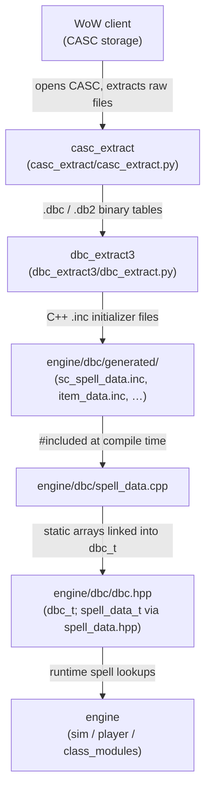

# Game-Data Pipeline

How WoW client spell and game data flows from extraction tooling into the sim as compiled-in C++ tables.
Standalone read; useful background before reading `engine/dbc/dbc.hpp` or any class-module spell lookup.

---

## Pipeline flowchart

All steps from CASC extraction through C++ generation happen offline and are committed to the repository.
The engine itself performs no file I/O for game data at run-time; it reads compiled-in static arrays.

---

## Producing: extracting raw DBC/DB2 from the WoW client

WoW stores its game tables in a content-addressable file system called **CASC** (Content Addressable
Storage Container). `casc_extract/casc_extract.py:1` is a Python 3 script that opens a local WoW
installation, locates the correct storage manifest, and writes out the raw `.dbc`/`.db2` binary table
files consumed by the next stage. Windows batch helpers in `casc_extract/` (e.g.
`WinGenerateSpellData.bat`) wrap common extraction presets for data maintainers.

---

## Emitting: generating C++ from DBC/DB2

`dbc_extract3/dbc_extract.py:1` is the main Python 3 driver for the data generation step. It parses
`.dbc`/`.db2` files and emits C++ static array initializers. Key CLI options:

- `-t output` (default) — write C++ initializer blocks for all configured tables.
- `-b / --build` — pin the WoW patch version (e.g. `12.0.7.68275`) so that generated files carry
  a matching version comment.
- `-t scale`, `-t csv`, `-t json` — alternative output modes for scaling tables, CSV inspection,
  and JSON dumps.

For each table the tool writes a pair of `.inc` files — one for the live client build and a `_ptr`
variant for PTR — into `engine/dbc/generated/`. As of build 12.0.7.68275 (see
`engine/dbc/generated/client_data_version.inc:1`) the generated set includes approximately thirty
table pairs. A representative sample:

| Generated file | Contents |
|---|---|
| `engine/dbc/generated/sc_spell_data.inc:1` | 31 040 `spell_data_t` C++ initializers |
| `engine/dbc/generated/item_data.inc:1` | item base-stat rows |
| `engine/dbc/generated/class_spells.inc:1` | per-class / per-spec spell lists |
| `engine/dbc/generated/sc_scale_data.inc:1` | level-scaling coefficients |
| `engine/dbc/generated/client_data_version.inc:1` | version constants (`CLIENT_DATA_WOW_VERSION`, etc.) |

See `dbc_extract3/README.md` and `dbc_extract3/generate.sh` for the full invocation details.

---

## Consuming: the C++ access layer

`engine/dbc/spell_data.cpp:4` pulls the generated tables into the build with a direct `#include` of
`generated/sc_spell_data.inc` (and the PTR twin under `#if SC_USE_PTR`). The spell tables are baked
into the binary as static C arrays — no file I/O at run-time.

The central type for spell lookups is `spell_data_t`, declared at `engine/dbc/spell_data.hpp:439`.
Every field corresponds to a DBC column: `_name`, `_id`, `_school`, `_cooldown`, `_spell_level`,
effect references, and so on.

`engine/dbc/dbc.hpp:311` declares `dbc_t`, the main facade through which every engine subsystem
accesses game data. The primary entry point is `dbc_t::spell()` at `engine/dbc/dbc.hpp:392`, which
resolves a numeric spell ID to a `const spell_data_t*` (always non-null by contract). `dbc_t` exposes
analogous accessors for items, racial spells, specialization data, azerite, embellishments, and more.

At run-time the sim holds one or two `dbc_t` instances (live and optional PTR). `sim_t`, `player_t`,
and every class module call `dbc.spell(id)` or the related helpers to read spell coefficients,
cooldowns, and resource costs during action resolution.

---

## Regenerating data

Run the following sequence when a WoW patch changes spell or item tables:

1. Use `casc_extract/casc_extract.py:1` (or a Windows helper in `casc_extract/`) to dump the updated
   `.dbc`/`.db2` files from the patched WoW installation.
2. Run `dbc_extract3/dbc_extract.py:1` with the appropriate `--build` version and output flags — see
   `dbc_extract3/generate.sh` for the standard invocation.
3. Commit the updated files under `engine/dbc/generated/` (and `engine/dbc/sc_extra_data.inc:1` if
   the manual supplement file was also edited).

Normal contributors and class-module authors never need to run this pipeline; the generated files are
committed to the repository and updated by a small number of data maintainers when a new WoW patch
ships.
